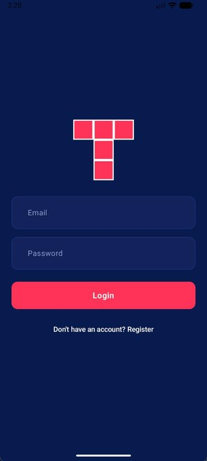
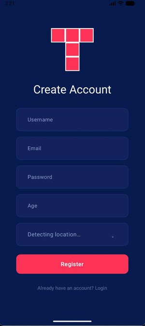
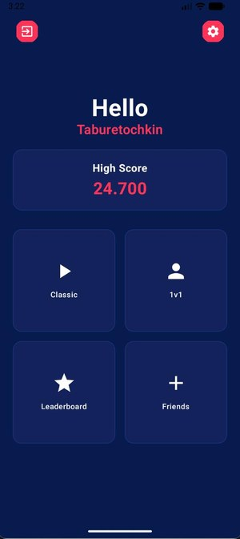
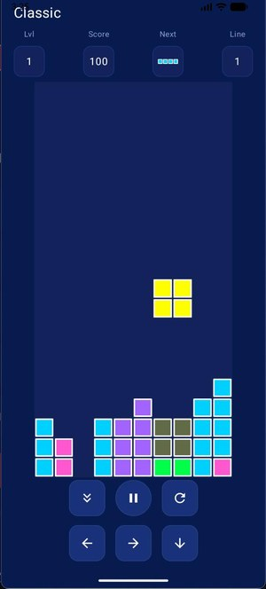
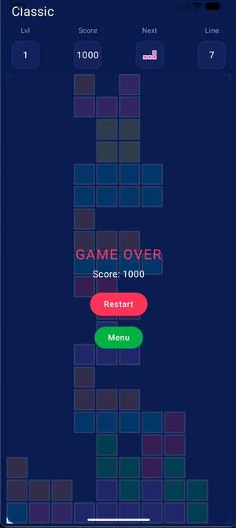
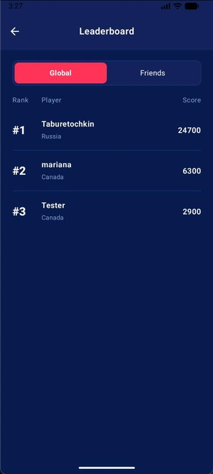

# Tetris 1v1 🎮

A modern Android implementation of classic Tetris with an online 1‑versus‑1 duel mode, built entirely in **Kotlin** with **Jetpack Compose**. Players compete in real time, sending "garbage lines" to their opponent, while a global leaderboard and a friends system tie the experience together.

> Coursework project — George Brown College, Mobile Application Development. ~3,900 lines of Kotlin across 47 files.

---

## 📱 Screenshots

<table>
  <tr>
    <td align="center"><br/><sub><b>Login</b></sub></td>
    <td align="center"><br/><sub><b>Register (geo-detected)</b></sub></td>
    <td align="center"><br/><sub><b>Home menu</b></sub></td>
  </tr>
  <tr>
    <td align="center"><br/><sub><b>Gameplay</b></sub></td>
    <td align="center"><br/><sub><b>Game over</b></sub></td>
    <td align="center"><br/><sub><b>Global leaderboard</b></sub></td>
  </tr>
</table>

---

## ✨ Features

- **Full Tetris engine** written from scratch — piece generation, rotation, collision detection, line clearing, scoring, leveling and speed curve.
- **Online 1v1 duels** — clear lines to send garbage rows to your opponent's board.
- **Firebase Authentication** — email/password sign‑up and login with a dedicated auth flow.
- **Cloud leaderboard** — high scores synced across all players via Cloud Firestore.
- **Friends system** — send, receive and accept friend requests.
- **Geolocation** — captures the player's country for the leaderboard using Play Services Location.
- **Material 3 UI** — clean, themed interface built fully in Jetpack Compose.

---

## 🏗️ Architecture

The project is organized into clear layers with a **unidirectional data flow (UDF)** at the core of the game logic:

```
ui/           → Compose screens & ViewModels (presentation layer)
  auth/         login, register, AuthViewModel
  game/         game screen, HUD, board rendering, GameViewModel
  friends/      friends list & requests
  leaderboard/  global high-score table
  profile/      user profile
  home/         main menu
game/         → pure game domain (no Android/Firebase dependencies)
  singletons/   GameEngine (reducer), BoardLogic
  controller/   LocalGameController, OnlineGameController
  data/         GameState, Piece, GameResult
  interfaces/   GameAction (sealed), GameController
models/       → domain models (User, FriendRequest, LeaderboardEntry)
```

The game engine is implemented as a **pure reducer**:

```kotlin
fun reduce(state: GameState, action: GameAction): GameState
```

Every input — `MoveLeft`, `RotateClockwise`, `HardDrop`, `Tick`, `AddGarbage(count, gapColumn)` — is a `GameAction`, and the engine returns a brand‑new immutable `GameState`. This makes the core logic deterministic, easy to test, and completely decoupled from the UI and the network layer.

---

## 🛠️ Tech Stack

| Area | Technologies |
|------|-------------|
| Language | Kotlin |
| UI | Jetpack Compose, Material 3, Navigation Compose |
| Architecture | MVVM, unidirectional data flow, ViewModel |
| Async | Kotlin Coroutines |
| Backend | Firebase Authentication, Cloud Firestore |
| Location | Google Play Services Location |
| Testing | JUnit, Espresso, Compose UI Test |
| Build | Gradle (Kotlin DSL), version catalog |

**minSdk** 24 · **targetSdk / compileSdk** 36

---

## 🚀 Getting Started

### Prerequisites
- Android Studio (latest stable)
- JDK 11+
- A Firebase project

### Setup
1. Clone the repository:
   ```bash
   git clone https://github.com/Taburetochkin/tetris1v1.git
   ```
2. Create a Firebase project and enable **Authentication** (Email/Password) and **Cloud Firestore**.
3. Download your `google-services.json` and place it in the `app/` directory.
4. Open the project in Android Studio, let Gradle sync, and run on an emulator or device.

---

## 🎯 How It Works

**Scoring** follows the classic Tetris model — points scale with the number of lines cleared at once and the current level, the level increases every 10 lines, and drop speed ramps up as you level:

```kotlin
fun calculateLevel(totalLines: Int): Int = totalLines / 10 + 1
fun calculateSpeed(level: Int): Long =
    maxOf(MIN_SPEED_MS, BASE_SPEED_MS - level * SPEED_STEP_MS)
```

**Garbage mechanic** — in duel mode, clearing lines emits an `AddGarbage(count, gapColumn)` action against the opponent's board, pushing their stack up with a single gap column to dig out.

---

## 📌 Status

Core single‑player game, authentication, leaderboard and friends are complete. The online duel mode (real‑time garbage exchange and match‑making notifications) is under active development.

---

## 👤 Author

**Aleksei Zhukov** — [GitHub](https://github.com/Taburetochkin) · [Telegram](https://t.me/zheshaLukov)
